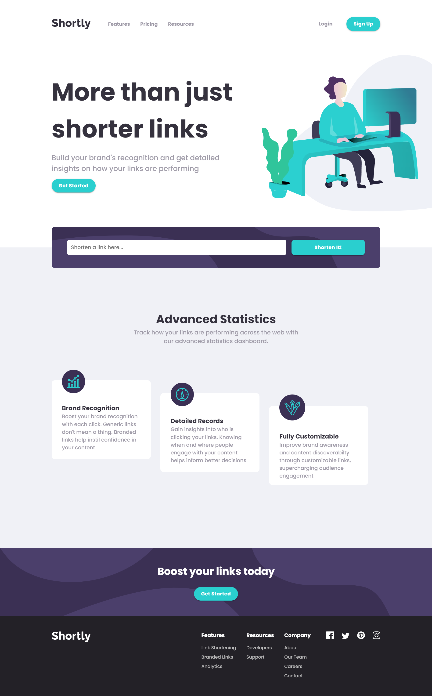

# Frontend Mentor - Shortly URL shortening API Challenge solution

This is a solution to the [Shortly URL shortening API Challenge challenge on Frontend Mentor](https://www.frontendmentor.io/challenges/url-shortening-api-landing-page-2ce3ob-G). Frontend Mentor challenges help you improve your coding skills by building realistic projects. 

## Table of contents

- [Overview](#overview)
  - [The challenge](#the-challenge)
  - [Screenshot](#screenshot)
  - [Links](#links)
- [My process](#my-process)
  - [Built with](#built-with)
  - [What I learned](#what-i-learned)
  - [Continued development](#continued-development)
  - [Useful resources](#useful-resources)
- [Author](#author)

## Overview

### The challenge

Users should be able to:

- View the optimal layout for the site depending on their device's screen size
- Shorten any valid URL
- See a list of their shortened links, even after refreshing the browser
- Copy the shortened link to their clipboard in a single click
- Receive an error message when the `form` is submitted if:
  - The `input` field is empty

### Screenshot

### Links

- Solution URL: [https://github.com/notanut/shortly-app.git](https://github.com/notanut/shortly-app.git)
- Live Site URL: [https://notanut.github.io/shortly-app/](https://notanut.github.io/shortly-app/)

## My process

### Built with

- Semantic HTML5 markup
- CSS custom properties
- Flexbox
- CSS Grid
- [React](https://reactjs.org/) - JS library

### What I learned

I learned A LOT from this challenge. I'm not really good at React, so this challenge was a good practice to boost up my React skills! 
I also use grid-column for the first time, and I'm suprised about how much CSS Grid can do! I learned how to use axios too.

#### UPDATE: I already know how to use local storage, and it works perfectly fine!

### Continued development

I wanna use React JS even more in my upcoming projects. Maybe I should give Angular and Vue a try too. 
Next, I'm planning to build a CRUD App using React

### Useful resources

- [Deploy React to GH Pages](https://github.com/gitname/react-gh-pages) - This helped me a lot to deploy my React App to GitHub Pages!
- [Kiran's solution](https://github.com/K-Mannnn/url-app/blob/gh-pages/src/main.js) - Thank you, I learned how to use axios and GET method from his/her code!

## Author

- Website - [Natasya](https://projects-nat.netlify.app/)
- Frontend Mentor - [@notanut](https://www.frontendmentor.io/profile/notanut)

## Acknowledgments

Thanks to [Kiran](https://www.frontendmentor.io/profile/K-Mannnn) ! Your solution inspired me a lot!